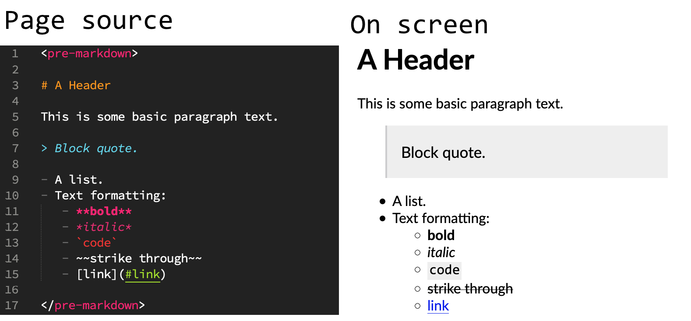

# `<pre-markdown>`

A web component to quickly include Markdown content in a page and have it rendered as HTML.



## Usage

`<pre-markdown>` can be used in two primary ways. The first is fencing [Markdown](https://en.wikipedia.org/wiki/Markdown) text within the page, similar to a `<pre>` tag. The second is to include an external Markdown file in a page.

Either way, it will render the Markdown as HTML within the page.

### Include the script
In your html, include the script (usually near the bottom, just before the `</body>` tag):

```html
<script src="path/to/pre-markdown.js"></script>
```

### Embedded Markdown


To render in-page markdown, wrap it in `<pre-markdown>` tags:

```markdown
<pre-markdown>
# This will display as an h1 header

This is some **bold** text, and this is *italics* using _different syntax_.

- This is a list.
- It has a [link](#link)
</pre-markdown>
```

The Markdown will be converted to HTML when the page is rendered.

### Include external Markdown

To embed an external Markdown file, set the `src` attribute in a`<pre-markdown>` tag:

```markdown
<pre-markdown src="my/markdown.md"></pre-markdown>
```

The Markdown file will be loaded, converted to HTML, and embedded in your page.

### Options

Set any of the following attributes to change the default behavior. (eg `<pre-markdown html="true" linkify="true">`

All attributes are optional.

- `src` : Link to an external Markdown file that will replace any content in the block.
- `css` : Link to an external CSS file to apply to the Markdown block.
  - NOTE: Effects of the external CSS is isolated to the block of Markdown and will completely override the built-in Markdown style.
- `html` : Set this to render HTML tags inside the Markdown. *Default: unset. HTML is escaped.*
- `linkify` : Set this to turn link-like things into links. (web addresses, emails, etc.) *Default: unset. URLS are unchanged.*
- `typographer` : Set this to do some language-neutral replacement and make quotes pretty. *Default: unset. Quotes are unchanged.*
- `breaks` : Set this to turn newlines (`\n`) within paragraphs into `<br>` tags. *Default: Unset. Single line breaks within a paragraph are ignored.*
- `markdown` : Set  the markdown content.
  - NOTE: For in-page Markdown, put it inside the `<pre-markdown>` tag or use the `src` attribute. This is intended only to dynamically update the content via `Element.setAttribute()` (See: `/examples/scripting.html`)

### Examples:

See the `/examples/` folder.

## Styling

Because the rendered Markdown is in the [shadow DOM](https://open-wc.org/guides/knowledge/styling/styles-piercing-shadow-dom/), styling the content is a little less different than most in-page content.

**1. The Markdown will use any *inheritable* properties from your page's style sheets.**

This includes things like, `color`, `cursor`, `direction`, `font-*`, `letter-spacing`, `line-height`, `text-align`, and `visibility`. [A full list of CSS attributes](https://www.w3.org/TR/CSS22/propidx.html) under the "Inherited?" column. 

**2. For the most control, use an external style sheet and the `css` tag.**

For example: `<pre-markdown css="css/style-dark.css">` 

- Using an external style sheet means none of the built-in styles are applied.
- Your external css should contain **`:host {display: block;}`** Otherwise it will display in-line and non-block properties (like, for instance `background-color`) won't render.
- The style sheet will only apply to the block containing the `css` property.
- You can use different styles on different blocks, or even change the `css` property dynamically.
- Browsers will only load the CSS once, even if it's applied to multiple blocks.

See **`examples/external-css.html`**

## Compatibility

### Browser

Roughly speaking `pre-markdown` is compatible with any browser that is capable of [autonomous custom elements](https://developer.mozilla.org/en-US/docs/Web/Web_Components/Using_custom_elements). [[compatability chart](https://caniuse.com/custom-elementsv1)].  This includes virtually every browser—desktop and mobile—that has had a release since 2018.

### Markdown

`<pre-markdown>` uses the [markdown-it](https://github.com/markdown-it/markdown-it) rendering engine which follows the [CommonMark specification](https://spec.commonmark.org/). It's generally compliant and fast, though not tiny. Parsing uses the [markdown-it defaults](https://markdown-it.github.io/markdown-it/). See [Options](#options) above for configuration options.

## License

```
pre-markdown is MIT licensed.
https://github.com/Grathio/pre-markdown
Copyright © 2020-2021 Steven Hoefer.
```

```
markdown-it is MIT licensed.
Copyright © 2014 Vitaly Puzrin, Alex Kocharin.
https://github.com/markdown-it/markdown-it
```
